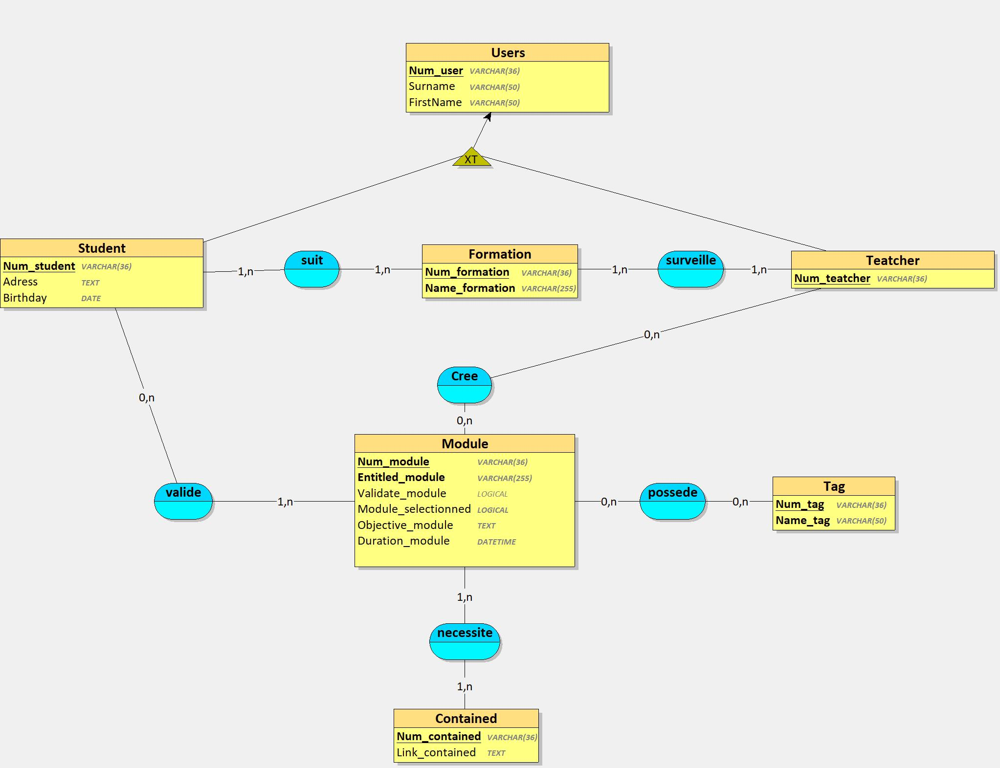
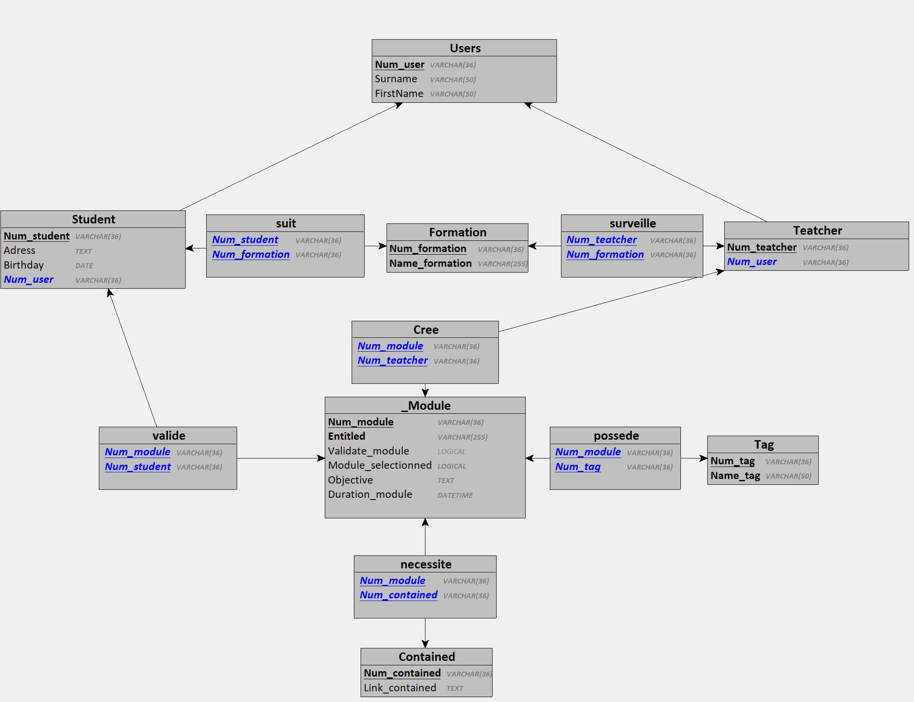

# beginMerise

## Consigne 


- Chaque module est caractérisé par un numéro de module sous forme de Semantic Versionning, un intitulé, un objectif pédagogique, une durée en heures, un ou plusieurs tags et un auteur.

- Un module peut faire partie d'une ou plusieurs formations, comme par exemple un pire module "Commandes de base Git" pourrait faire partie d'une pire formation "Frontend Javascript" et "DevOps", voir  plus.

- Un module peut contenir un texte et/ou une image et/ou une vidéo.

- Les apprenants peuvent s'inscrire à une ou plusieurs formations, ils peuvent choisir de ne pas suivre certains des modules s'ils possèdent déjà, par exemple, les compétences. Autrement dit, ils peuvent arbitrairement valider les modules de leur choix en un clic.

- Chaque apprenant est évalué pour chaque module et possède un état de fin de module (OK / KO).

- Une formation est considérée comme terminée lorsque tous les modules ont été validés.

- Chaque apprenant est caractérisé par un numéro d’inscription unique, un nom, un prénom, une adresse et une date de naissance.

- Un formateurs est auteur d'un module pour une formation donnée, chaque formateur est caractérisé par un code, un nom, un prénom.
<br><br/>

## Critères de performance


- La nomenclature MERISE est respectée

- Le méthode MERISE est respectée dans sa structure en découpant la conception de cette base de données en 3 niveaux : le niveau conceptuel, le niveau logique ou organisationnel, le niveau physique
<br><br/>

## Livrables


- Un dépôt Github recensant : 
    - Un README explicite et soigné
    - Une définition de l'acronyme MERISE dans le README.md
    - Un dictionnaire de données
    - Des règles de gestion
    - Un MCD
    - Un MLD
    - Un MPD
    - Un script SQL de la base de données
<br></br>
---

## Definition

**MERISE** : *Méthode d'étude et de réalisation informatique pour les systèmes d'entreprise* a été crée en France a la fin des années 1970. 

Il s'agit d'une méthode d'analyse et de conception des systèmes d'information basée sur le principe de la séparation des données et des traitement, divisé en 3 niveaux (conceptuel, logique,  physique).
<br> </br>

---

## Regle de Gestion
<br></br>

- **Modules:** 
    - 
    - *Contient:*
        - Un numero sous forme de Semantic Versionning
        - Un intitulé
        - Un objectif pédagogique
        - Un contenu de type (texte, video, image)
        - Une durée en heure
        - Un a plusieurs tags
        - Un auteur
    - *Peut être:*
        - Validé ou non par un étudient
        - Assimilé a une ou plusieurs formations
        <br></br>

- **Utilisateur:**
    - 
    - *Posséde:*
        - Un nom
        - un Prenom
        - Un identifiant unique
        - role 
    - *role : étudient*
        - Posséde une adresse
        - Posséde une date de naissance 
        - Peut selectionner une ou plusieur formation 
        - Peut choisir abritrairement les module qu' il veux
        - Est évaluer sur chaque module de la formation
    - *role : formateur*
        - Peut crée un module 
<br></br>

---

## Dictionnaire de données  
<br><br/>

| Nom | Type | Signification | Exemple |
| --- | ---- | ---------- | ------- |
| Num_module | uuid | identifiant du module | 123e4567-e89b-12d3-a456-426614174000 ........ |
| Entitled_module | String | Intitulé du module | front |
| Objective_module | String | objectif du module | connaitre le Css, la semantique Html |
| Duration_module | String | durée du module  en heure| 3h40 |
| Validate_module | Bool | validation du module par l' etudient | true |
| Module_selectionned | Bool |  selection du module par l'étudient |
| Num_user | uuid | id utilisateur | 123e4567-e89b-12d3-a456-426614174000 ........ | 
| Surname| String | nom utilisateur | h | 
| FirstName | String | prenom utilisateur | hachemi | 
| Num_student | uuid | id etudient | 123e4567-e89b-12d3-a456-426614174000 ........ | 
| Adress | string | adresse de l'étudient | 33 rue bidon 75001 Paris |
| Birthday | timestamp | date de naisse de l'étudient | 1660816909 |
| Num_teatcher | uuid | id formateur | 123e4567-e89b-12d3-a456-426614174000 ........ | 
| Num_formation | uuid | id formation | 123e4567-e89b-12d3-a456-426614174000 ........ | 
| Name_formation | String | nom de la formation  |  dev web | 
| Num-tag | uuid | id tag | 123e4567-e89b-12d3-a456-426614174000 ........ | 
| Name_tag | array | tag du module | react, git, ...|
| Num_contained | uuid | id contenu | 123e4567-e89b-12d3-a456-426614174000 ........ | 
| Link_contained | String  |  URL  de contenu pour le  module | `https://foo.toto.png` |
<br></br>

---

## MCD 


<br></br>

---

## MLD 


<br></br>

---

## MPD 

<br>

``_Module = (Num_module VARCHAR(32), Entitled VARCHAR(255), Validate_module LOGICAL, Module-selectionned LOGICAL, Objective_module TEXT, _Duration_module DATETIME);`` <br>
``Users = (Num_user VARCHAR(32), Surname VARCHAR(50), FirstName VARCHAR(50));``<br>
``Teatcher = (Num_teatcher VARCHAR(32), #Num_user);``<br>
``Student = (Num_student VARCHAR(32), Adress TEXT, Birthday DATE, #Num_user);``<br>
``Tag = (Num_tag VARCHAR(32), Name_user VARCHAR(50));``<br>
``Contained = (Num_contained VARCHAR(32), Link_contained TEXT);``<br>
``Formation = (Num_formation VARCHAR(32), Name_formation VARCHAR(255));``<br> 
``Cree = (#Num_module, #Num_teatcher);``<br>
``possede = (#Num_module, #Num_tag);``<br> 
``necessite = (#Num_module, #Num_contained);``<br>
``suit = (#Num_student, #Num_formation);``<br>
``valide = (#Num_module, #Num_student);``<br>
``surveille = (#Num_teatcher, #Num_formation);``<br>
<br></br>


### Code SQL

<br>

```
CREATE TABLE _Module(
   Num_module VARCHAR(36),
   Entitled VARCHAR(255) NOT NULL,
   Validate_module LOGICAL,
   Module_selectionned LOGICAL NOT NULL,
   Objective TEXT NOT NULL,
   Duration_module DATETIME NOT NULL,
   PRIMARY KEY(Num_module),
   UNIQUE(Entitled)
);

CREATE TABLE Users(
   Num_user VARCHAR(36),
   Surname VARCHAR(50) NOT NULL,
   FirstName VARCHAR(50) NOT NULL,
   PRIMARY KEY(Num_user)
);

CREATE TABLE Teatcher(
   Num_teatcher VARCHAR(36),
   Num_user VARCHAR(36) NOT NULL,
   PRIMARY KEY(Num_teatcher),
   UNIQUE(Num_user),
   FOREIGN KEY(Num_user) REFERENCES Users(Num_user)
);

CREATE TABLE Student(
   Num_student VARCHAR(36),
   Adress TEXT NOT NULL,
   Birthday DATE NOT NULL,
   Num_user VARCHAR(36) NOT NULL,
   PRIMARY KEY(Num_student),
   UNIQUE(Num_user),
   FOREIGN KEY(Num_user) REFERENCES Users(Num_user)
);

CREATE TABLE Tag(
   Num_tag VARCHAR(36),
   Name_tag VARCHAR(50) NOT NULL,
   PRIMARY KEY(Num_tag),
   UNIQUE(Name_tag)
);

CREATE TABLE Contained(
   Num_contained VARCHAR(36),
   Link_contained TEXT NOT NULL,
   PRIMARY KEY(Num_contained)
);

CREATE TABLE Formation(
   Num_formation VARCHAR(36),
   Name_formation VARCHAR(255) NOT NULL,
   PRIMARY KEY(Num_formation),
   UNIQUE(Name_formation)
);

CREATE TABLE Cree(
   Num_module VARCHAR(36),
   Num_teatcher VARCHAR(36),
   PRIMARY KEY(Num_module, Num_teatcher),
   FOREIGN KEY(Num_module) REFERENCES _Module(Num_module),
   FOREIGN KEY(Num_teatcher) REFERENCES Teatcher(Num_teatcher)
);

CREATE TABLE possede(
   Num_module VARCHAR(36),
   Num_tag VARCHAR(36),
   PRIMARY KEY(Num_module, Num_tag),
   FOREIGN KEY(Num_module) REFERENCES _Module(Num_module),
   FOREIGN KEY(Num_tag) REFERENCES Tag(Num_tag)
);

CREATE TABLE necessite(
   Num_module VARCHAR(36),
   Num_contained VARCHAR(36),
   PRIMARY KEY(Num_module, Num_contained),
   FOREIGN KEY(Num_module) REFERENCES _Module(Num_module),
   FOREIGN KEY(Num_contained) REFERENCES Contained(Num_contained)
);

CREATE TABLE suit(
   Num_student VARCHAR(36),
   Num_formation VARCHAR(36),
   PRIMARY KEY(Num_student, Num_formation),
   FOREIGN KEY(Num_student) REFERENCES Student(Num_student),
   FOREIGN KEY(Num_formation) REFERENCES Formation(Num_formation)
);

CREATE TABLE valide(
   Num_module VARCHAR(36),
   Num_student VARCHAR(36),
   PRIMARY KEY(Num_module, Num_student),
   FOREIGN KEY(Num_module) REFERENCES _Module(Num_module),
   FOREIGN KEY(Num_student) REFERENCES Student(Num_student)
);

CREATE TABLE surveille(
   Num_teatcher VARCHAR(36),
   Num_formation VARCHAR(36),
   PRIMARY KEY(Num_teatcher, Num_formation),
   FOREIGN KEY(Num_teatcher) REFERENCES Teatcher(Num_teatcher),
   FOREIGN KEY(Num_formation) REFERENCES Formation(Num_formation)
);

```